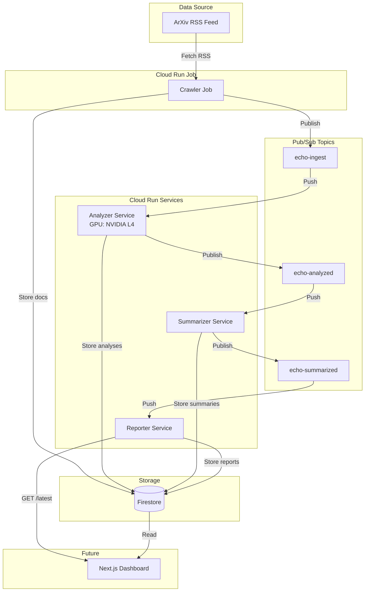

# Project ECHO Architecture

## Overview

Project ECHO is an autonomous, serverless AI research pipeline running on Google Cloud Run. It automatically crawls ArXiv for computer science papers, analyzes them, generates summaries, and creates daily HTML reports.

## System Architecture



## Components

### 1. Crawler (Cloud Run Job)
- **Type**: Batch job (runs to completion)
- **Trigger**: Manual or scheduled
- **Function**: 
  - Fetches ArXiv computer science RSS feed
  - Processes first 10 entries
  - Stores documents in Firestore
  - Publishes to `echo-ingest` topic
- **Storage**: `documents` collection

### 2. Analyzer Service (Cloud Run Service + GPU)
- **Type**: Web service with NVIDIA L4 GPU
- **Trigger**: Pub/Sub push from `echo-ingest`
- **Function**:
  - Receives document IDs
  - Performs topic extraction and analysis
  - Stores analysis results in Firestore
  - Publishes to `echo-analyzed` topic
- **Storage**: `analyses` collection
- **Resources**: 4 vCPU, 16GB RAM, 1x NVIDIA L4 GPU

### 3. Summarizer Service (Cloud Run Service)
- **Type**: Web service
- **Trigger**: Pub/Sub push from `echo-analyzed`
- **Function**:
  - Receives analyzed document IDs
  - Generates summary text
  - Stores summaries in Firestore
  - Publishes to `echo-summarized` topic
- **Storage**: `summaries` collection
- **Resources**: 1 vCPU, 512MB RAM

### 4. Reporter Service (Cloud Run Service)
- **Type**: Web service
- **Trigger**: Pub/Sub push from `echo-summarized`
- **Function**:
  - Aggregates all summaries
  - Generates HTML report
  - Stores report in Firestore
  - Exposes `/latest` endpoint for retrieval
- **Storage**: `reports` collection
- **Resources**: 1 vCPU, 512MB RAM
- **Endpoints**:
  - `GET /` - Service health
  - `GET /healthz` - Health check
  - `POST /report` - Generate report (Pub/Sub)
  - `GET /latest` - Retrieve latest report

## Data Flow

1. **Ingestion**: Crawler → Firestore (`documents`) → Pub/Sub (`echo-ingest`)
2. **Analysis**: Analyzer → Firestore (`analyses`) → Pub/Sub (`echo-analyzed`)
3. **Summarization**: Summarizer → Firestore (`summaries`) → Pub/Sub (`echo-summarized`)
4. **Reporting**: Reporter → Firestore (`reports`)

## Firestore Collections

### `documents`
```json
{
  "title": "Paper Title",
  "link": "https://arxiv.org/abs/...",
  "summary": "Abstract text...",
  "source": "arxiv",
  "created_at": "timestamp"
}
```

### `analyses`
```json
{
  "doc_id": "document_id",
  "topics": ["machine learning", "nlp"],
  "score": 85.5,
  "created_at": "timestamp"
}
```

### `summaries`
```json
{
  "doc_id": "document_id",
  "summary": "Summary text",
  "topics": ["machine learning"],
  "created_at": "timestamp"
}
```

### `reports`
```json
{
  "html": "<h1>Daily ECHO</h1><ul>...</ul>",
  "summary_count": 10,
  "created_at": "timestamp"
}
```

## Pub/Sub Topics & Subscriptions

| Topic | Subscription | Endpoint | Service Account |
|-------|--------------|----------|-----------------|
| `echo-ingest` | `sub-analyze` | `analyzer/analyze` | `pubsub-push@...` |
| `echo-analyzed` | `sub-summarize` | `summarizer/summarize` | `pubsub-push@...` |
| `echo-summarized` | `sub-report` | `reporter/report` | `pubsub-push@...` |

All subscriptions use OIDC authentication with the `pubsub-push` service account.

## Security

- Services deployed with `--allow-unauthenticated` for external access
- Pub/Sub push uses OIDC service account authentication
- Service account has `roles/run.invoker` on all services
- Firestore uses default IAM permissions

## Deployment

All services are deployed to:
- **Project**: `echo-476821`
- **Region**: `europe-west4`
- **Artifact Registry**: `echo-repo`

See `infra/scripts/` for deployment automation.

## Future Enhancements

1. **Dashboard**: Next.js web interface for viewing reports and stats
2. **Advanced Analysis**: ML models for better topic extraction
3. **Scheduling**: Cloud Scheduler for automatic crawler runs
4. **Monitoring**: Cloud Monitoring dashboards and alerts
5. **Multi-source**: Support for more data sources beyond ArXiv
