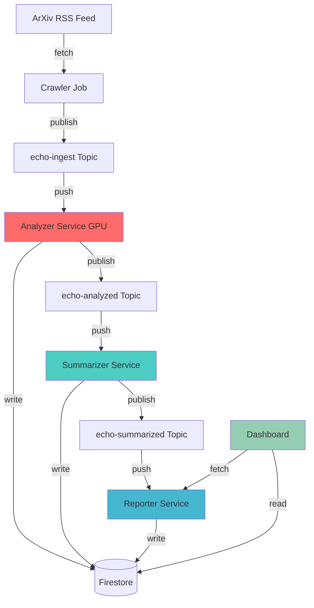
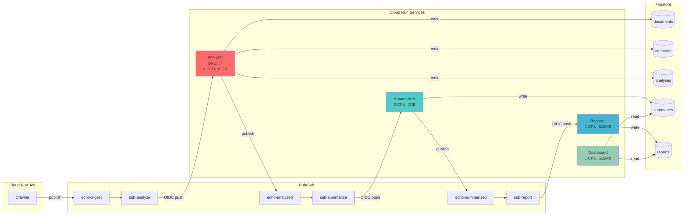
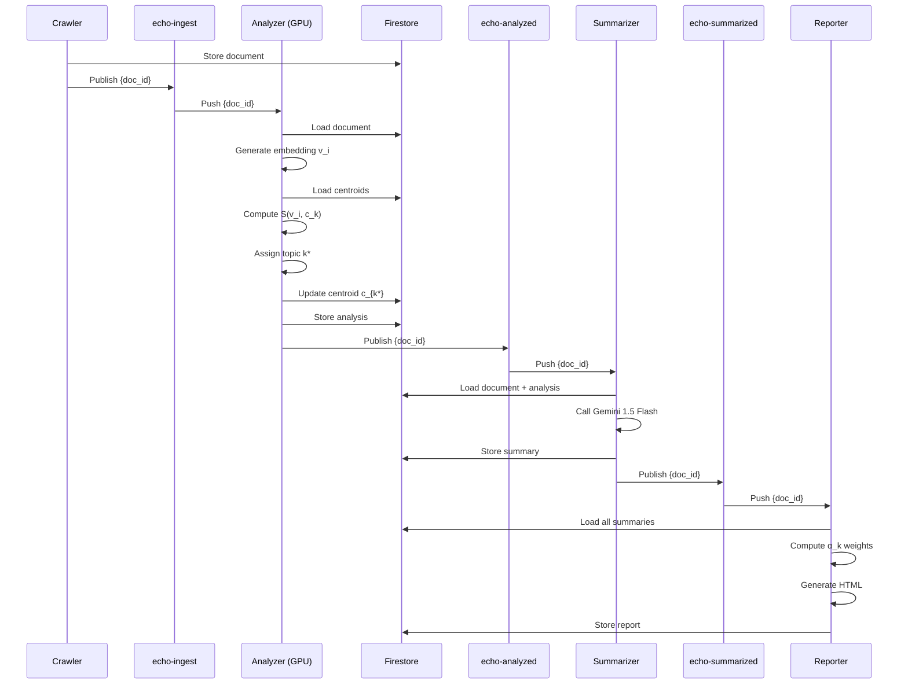
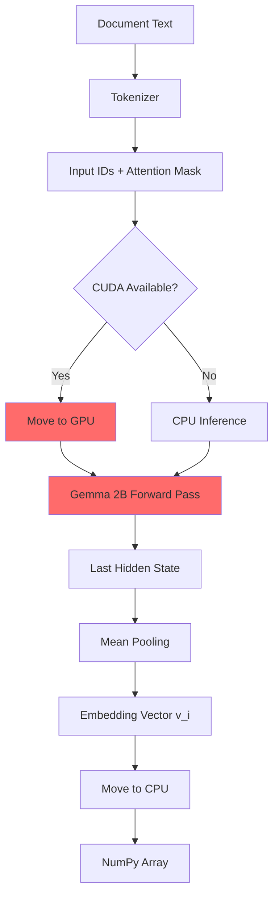
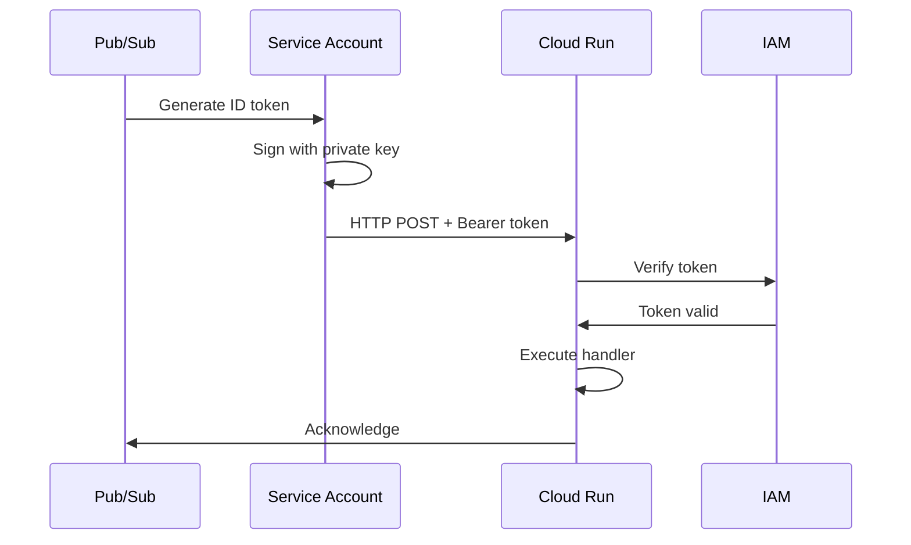
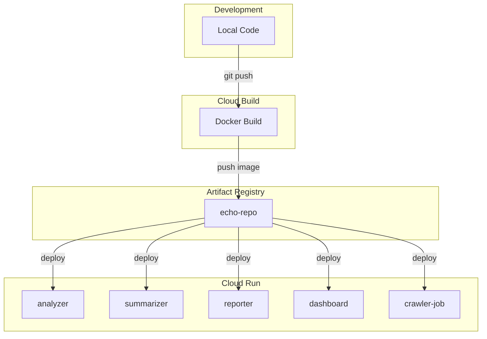

# Project ECHO - Architecture Documentation

## System Architecture

### High-Level Data Flow



### Detailed Component Architecture



## Mathematical Model

### 1. Embedding Space

Documents are embedded into a high-dimensional vector space using Gemma 2B:

$$
f_{Gemma}: \mathcal{D} \rightarrow \mathbb{R}^n
$$

Where:
- $\mathcal{D}$ is the space of documents (text)
- $n$ is the embedding dimension (typically 768 or 2048)
- $f_{Gemma}$ applies mean pooling over the last hidden state

For document $d_i$:

$$
\mathbf{v}_i = \frac{1}{|T|} \sum_{t \in T} h_t
$$

Where $h_t$ is the hidden state at token $t$, and $T$ is the set of all tokens.

### 2. Similarity Metric

Cosine similarity between two embeddings:

$$
S(\mathbf{v}_i, \mathbf{v}_j) = \frac{\mathbf{v}_i \cdot \mathbf{v}_j}{\|\mathbf{v}_i\|_2 \cdot \|\mathbf{v}_j\|_2} = \frac{\sum_{k=1}^n v_{i,k} \cdot v_{j,k}}{\sqrt{\sum_{k=1}^n v_{i,k}^2} \cdot \sqrt{\sum_{k=1}^n v_{j,k}^2}}
$$

Properties:
- $S \in [-1, 1]$
- $S = 1$ indicates identical direction
- $S = 0$ indicates orthogonality
- $S = -1$ indicates opposite direction

### 3. Online Clustering Algorithm

#### Initialization

Start with no clusters: $\mathcal{C} = \emptyset$

#### For each new document $d_i$:

**Step 1: Generate embedding**

$$
\mathbf{v}_i = f_{Gemma}(d_i)
$$

**Step 2: Find best matching cluster**

$$
k^* = \arg\max_{k \in \mathcal{C}} S(\mathbf{v}_i, \mathbf{c}_k)
$$

Where $\mathbf{c}_k$ is the centroid of cluster $k$.

**Step 3: Threshold decision**

```
if S(v_i, c_{k*}) >= τ and |C| > 0:
    assign document to cluster k*
    update centroid c_{k*}
elif |C| < MAX_CLUSTERS:
    create new cluster k_new
    c_{k_new} = v_i
else:
    force assign to k*
```

Where:
- $\tau = 0.8$ (similarity threshold)
- $MAX\_CLUSTERS = 20$

**Step 4: Centroid update (Exponential Moving Average)**

$$
\mathbf{c}_k^{(t+1)} = (1 - \alpha) \mathbf{c}_k^{(t)} + \alpha \mathbf{v}_i
$$

Where $\alpha = 0.1$ is the learning rate.

### 4. Topic Weighting

For reporting, compute topic weights based on cluster sizes:

$$
\alpha_k = \frac{|C_k|}{\sum_{j=1}^{K} |C_j|}
$$

Where:
- $|C_k|$ is the number of documents in cluster $k$
- $K$ is the total number of clusters
- $\sum_{k=1}^K \alpha_k = 1$

This ensures topics with more papers get higher prominence in reports.

### 5. Time-Windowed Aggregation

For daily reports, filter documents by timestamp:

$$
\mathcal{D}_{window} = \{d \in \mathcal{D} : t_0 \leq t(d) \leq t_1\}
$$

Where:
- $t_0 = \text{current\_time} - 24 \text{ hours}$
- $t_1 = \text{current\_time}$
- $t(d)$ is the timestamp of document $d$

## Data Flow Sequences

### Document Processing Pipeline



### GPU Inference Flow



## Service Specifications

### Analyzer

**Compute**:
- CPU: 4 cores
- Memory: 16 GB
- GPU: 1x NVIDIA L4
- Execution Environment: Gen2
- Concurrency: 4
- Timeout: 300s

**Model**:
- Primary: `google/gemma-2b` (FP16)
- Fallback: `sentence-transformers/all-MiniLM-L6-v2`
- Framework: PyTorch + Transformers

**Storage**:
- Collections: `documents`, `analyses`, `centroids`
- Embedding dimension stored for validation

**Performance**:
- Cold start: ~25s (model loading)
- Warm inference: ~2s per document
- GPU utilization: ~60-80%

### Summarizer

**Compute**:
- CPU: 2 cores
- Memory: 2 GB
- Concurrency: 80
- Timeout: 60s

**Model**:
- Gemini 1.5 Flash
- Max tokens: 500
- Temperature: 0.3

**Prompt Template**:
```python
"""You are a research summarizer. Given the following research paper details, 
create a concise, professional summary in ONE sentence.

Title: {title}
Abstract: {abstract}
Assigned Topics: {topics}

Provide a single-sentence summary that captures the key contribution 
and relates to the assigned topics. Be precise and academic.

Summary:"""
```

**Storage**:
- Collection: `summaries`
- Fields: doc_id, summary, topics, model_used, summary_time, created_at

### Reporter

**Compute**:
- CPU: 1 core
- Memory: 512 MB
- Concurrency: 80
- Timeout: 60s

**Aggregation Logic**:
1. Fetch summaries from last 24h (fallback to all)
2. Compute topic weights: $\alpha_k = |C_k| / \sum_j |C_j|$
3. Group by primary topic
4. Sort topics by weight (descending)
5. Generate HTML with topic headers showing counts and percentages

**HTML Structure**:
```html
<h1>ECHO Research Intelligence Report</h1>
<p><em>Generated on 2025-11-01 12:00 UTC</em></p>
<p><strong>Total Papers:</strong> 23 | <strong>Topics:</strong> 5</p>
<hr>
<h2>Topic 01 (10 papers, 43.5%)</h2>
<ul>
  <li>Paper summary 1...</li>
  <li>Paper summary 2...</li>
</ul>
<h2>Topic 02 (7 papers, 30.4%)</h2>
...
```

### Dashboard

**Framework**: Next.js 15 (App Router)

**Key Routes**:
- `/` - Main dashboard
- `/api/papers` - Fetch papers from Firestore
- `/api/stats` - Pipeline statistics
- `/api/status` - Service health

**Features**:
- Server-side Firebase Admin SDK
- Real-time data fetching (SWR, 10s refresh)
- Material 3 dark theme
- Responsive design

## Security Model

### Authentication Flow



**Service Account**: `pubsub-push@echo-476821.iam.gserviceaccount.com`

**IAM Bindings**:
```bash
gcloud run services add-iam-policy-binding analyzer \
  --member="serviceAccount:pubsub-push@echo-476821.iam.gserviceaccount.com" \
  --role="roles/run.invoker"
```

Applied to: `analyzer`, `summarizer`, `reporter`

### Firestore Security

All services use Application Default Credentials (ADC):
- In Cloud Run: Automatic via metadata server
- Local dev: `gcloud auth application-default login`

No Firestore security rules needed (backend-only access).

## Deployment Architecture



**Build Process**:
```bash
gcloud builds submit services/analyzer \
  --tag europe-west4-docker.pkg.dev/echo-476821/echo-repo/analyzer:v1 \
  --timeout=20m  # GPU image is large
```

**Deployment Process**:
```bash
gcloud run deploy analyzer \
  --image europe-west4-docker.pkg.dev/echo-476821/echo-repo/analyzer:v1 \
  --gpu=1 \
  --gpu-type=nvidia-l4 \
  --execution-environment=gen2
```

## Monitoring & Observability

### Structured Logging

All services emit structured logs:

```json
{
  "severity": "INFO",
  "message": "Analysis created for doc_id: arxiv-123",
  "doc_id": "arxiv-123",
  "topics": ["topic_01"],
  "score": 92.5,
  "analysis_time": 2.34
}
```

### Key Metrics to Monitor

1. **Analyzer**:
   - GPU utilization
   - Embedding generation time
   - Centroid count
   - CUDA errors

2. **Summarizer**:
   - Gemini API latency
   - API quota usage
   - Summary length distribution

3. **Reporter**:
   - Report generation time
   - Topic count
   - Paper count per report

4. **Overall**:
   - End-to-end pipeline latency
   - Pub/Sub message age
   - Firestore read/write ops
   - Cold start frequency

### Log Queries

```bash
# Analyzer GPU detection
gcloud beta logging read 'resource.type=cloud_run_revision AND resource.labels.service_name=analyzer AND textPayload=~"CUDA detected"' --limit=10

# End-to-end pipeline trace
gcloud beta logging read 'jsonPayload.doc_id="arxiv-123"' --format=json

# Error rates
gcloud beta logging read 'severity>=ERROR' --limit=50
```

## Cost Model

### Per-Document Processing Cost

| Component | Time | Cost/s | Cost/doc |
|-----------|------|--------|----------|
| Analyzer (GPU) | 2s | $0.0001 | $0.0002 |
| Summarizer (Gemini) | 1.5s | - | ~$0.0005 |
| Reporter | 0.1s | $0.00001 | $0.000001 |
| **Total** | **~4s** | - | **~$0.0007** |

### Monthly Cost (1000 papers)

- Processing: $0.70
- Firestore: <$1
- Pub/Sub: $0
- Cloud Run (idle): $0
- **Total: <$2/month**

### Scaling Cost

| Papers/month | Processing | Storage | Total |
|--------------|------------|---------|-------|
| 1,000 | $0.70 | $1 | **$2** |
| 10,000 | $7 | $5 | **$12** |
| 100,000 | $70 | $20 | **$90** |

## Performance Optimization

### 1. Lazy Initialization

All expensive resources initialized on first use:
- Firestore client
- Pub/Sub publisher
- Gemma model
- Gemini client

Prevents cold start crashes.

### 2. GPU Memory Management

```python
with torch.no_grad():
    outputs = model(**inputs)
    embeddings = outputs.last_hidden_state.mean(dim=1)
    embedding_vector = embeddings.cpu().numpy().flatten()
```

Move to CPU immediately to free GPU memory.

### 3. Centroid Caching

Load all centroids once per request, not per similarity computation.

### 4. Batch Processing

Analyzer configured with `concurrency=4` to batch GPU inference when possible.

## Failure Modes & Recovery

### 1. GPU Allocation Failure

**Symptom**: Analyzer falls back to CPU

**Detection**: Logs show "CUDA not available"

**Recovery**: 
- Auto-scales new instance with GPU
- Old instance completes on CPU (slower)

### 2. Gemini API Rate Limit

**Symptom**: 429 errors in summarizer

**Recovery**:
- Exponential backoff built into client
- Pub/Sub redelivery after ack deadline

### 3. Firestore Write Conflicts

**Symptom**: Concurrent centroid updates

**Mitigation**:
- Last-write-wins semantics
- Centroids converge over time
- No critical consistency requirement

### 4. Cold Start Timeouts

**Symptom**: 504 errors during GPU model load

**Mitigation**:
- 300s timeout on analyzer
- Pub/Sub extends ack deadline automatically
- Consider min-instances=1 for warmth

## Future Enhancements

1. **Semantic Topic Names**: Use Gemini to name topics based on centroid nearest papers
2. **Multi-Source Integration**: Add PubMed, bioRxiv, OpenReview
3. **User Feedback Loop**: Allow users to correct topic assignments
4. **Incremental Embeddings**: Only recompute for new papers
5. **Distributed Clustering**: Shard centroids across instances
6. **RAG Integration**: Use embeddings for semantic search
7. **Notification System**: Email/Slack alerts for new topics

## References

1. Vaswani et al., "Attention Is All You Need" (2017)
2. Google Gemini Technical Report (2024)
3. Cloud Run GPU Documentation
4. Pub/Sub Push Authentication
5. Firestore Best Practices

---

**Last Updated**: 2025-11-01
**Version**: v1.0
**Author**: Project ECHO Team
